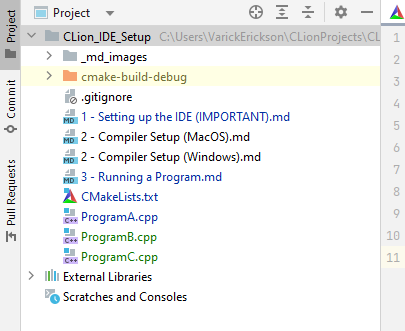

# Compiling and Running a program

In this section, we will go over how CLion compiles and runs programs

# Compiling using CMake

Many developers use CMake to compile programs as it allows for 
easier cross-platform compiling and does not depend on any specific compiler.

> "In software development, CMake is cross-platform free and open-source
> software for build automation, testing and packaging using a
> compiler-independent method. CMake is not a build system but rather it's a
> build-system generator. It supports directory hierarchies and applications
> that depend on multiple libraries."
>
> - https://en.wikipedia.org/wiki/CMake

In the project, you will notice that there are three different cpp files 
(`ProgramA.cpp`, `ProgramB.cpp`, `ProgramC.cpp`), 
each with their own mains:




To compile each of these programs, we use the `CMakeLists.txt file`.


The `add_executable` is the CMake function to create a compiled program.

```cmake
# ProgramA_Exe is the name of the program
# The arguments afterwards are the source files needed to make the program.
add_executable(ProgramA_Exe ProgramA.cpp)
```

In the example above, `ProgramA_Exe` is the name of the compiled program. The 
files that come after the name are the source files required to compile the 
program.

# Running Programs

The programs created by CMake are found in the Run Configurations dropdown menu.


To run a specific program, just select the program you want to run and hit 
the run button.


The console output of the program should be visible at the bottom:

