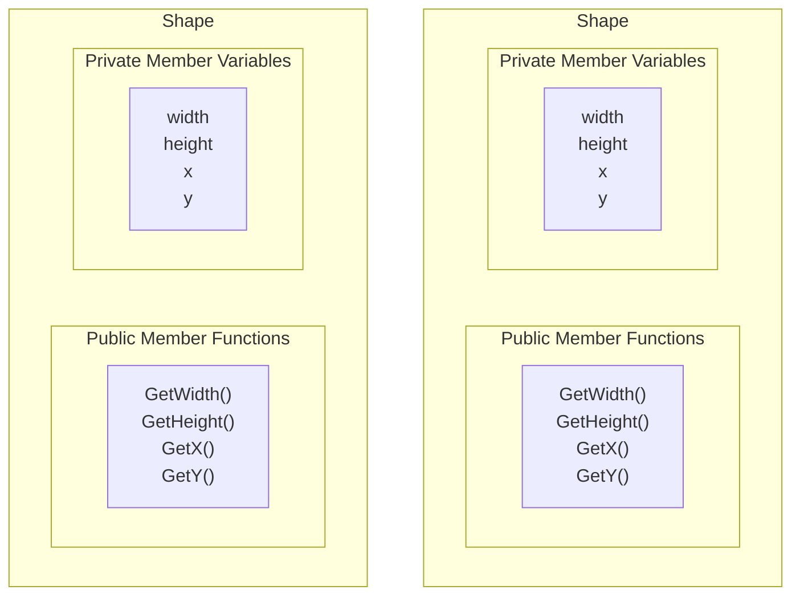

## `struct`

There are many instances where it is convenient to group variables together.

## `struct` versus `class`
The only difference between `struct` and `class` is that all `struct` methods 
and member variables are `public`.  A `class` can have both private and 
public methods and member variables.

